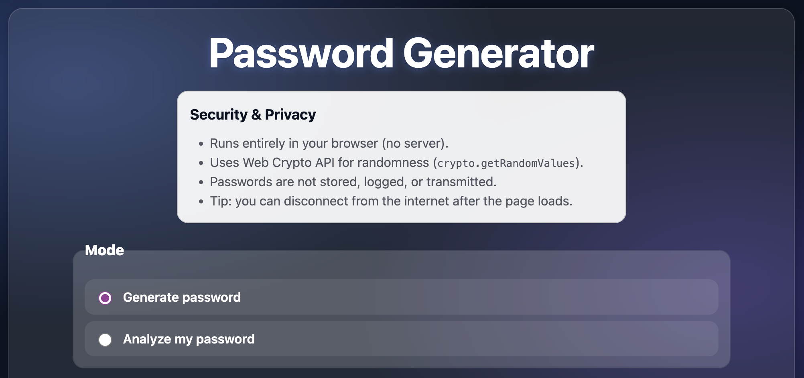
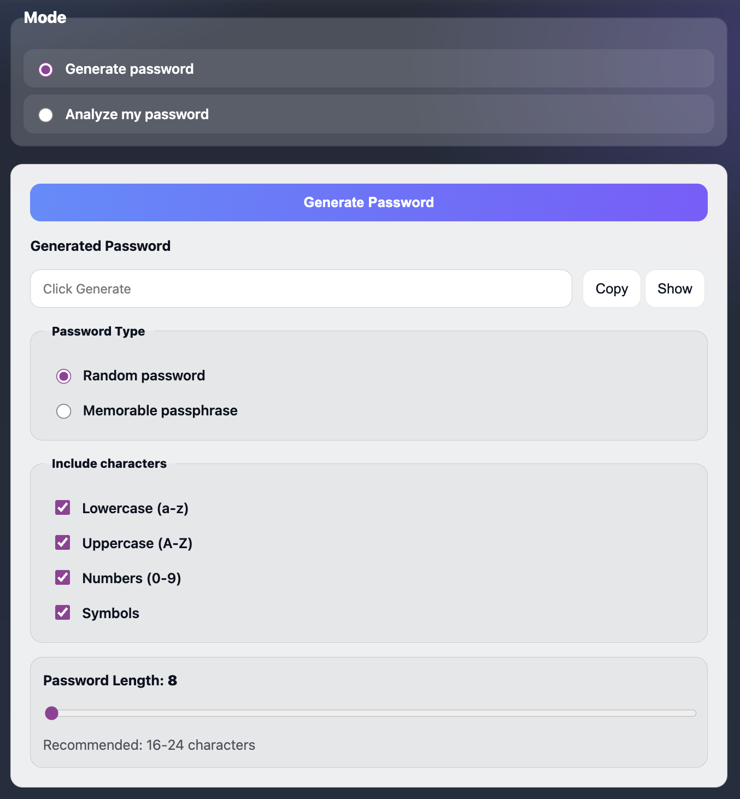
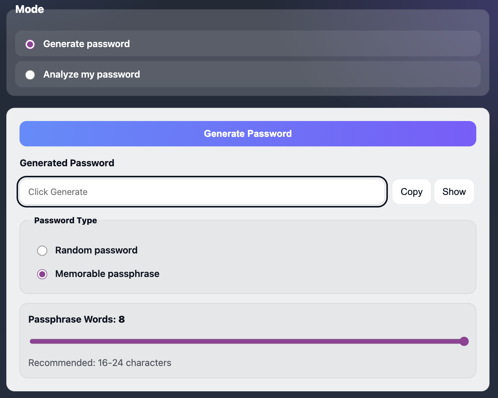
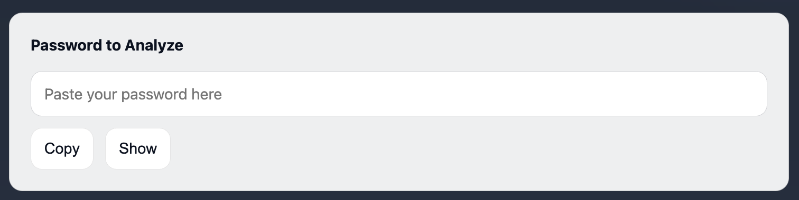

# Password Generator & Analyzer

**Demo:** [put link here]

A password generator and password strength analyzer focusing on security, accessibility, and simple UI design. All operations run within the browser, and no passwords are stored or transmitted.

## Features:
* 2 Modes:
    - Generate secure passwords (random or memorable word-based passphrase) using Web Crypto API
        - Control length of generated password using slidebar
        - Can select characters to be included within generated password (lowercase, uppercase, numbers, symbols)

    - Analyzing user's inputted password

* In both modes, passwords are analyzed for:
    - Estimated entropy (bits)
    - Strength rating
    - Time-to-crack estimates (online vs offline)
* Toggle password visibility
* Copy passwords to clipboard
* No server, tracking, or storage of passwords

Getting Started Instructions:
* Clone the repository
* Double right click the mouse on top of the index.html file on the left bar
* Click "Open with Live Server"
* Enjoy!

Project Structure:
* index.html
* css/style.css
* js/script.js

Security & Privacy:
* Uses `crypto.getRandomValues()`
* No network requests
* not stored or logged
* Optional "disconnect internet after load" note